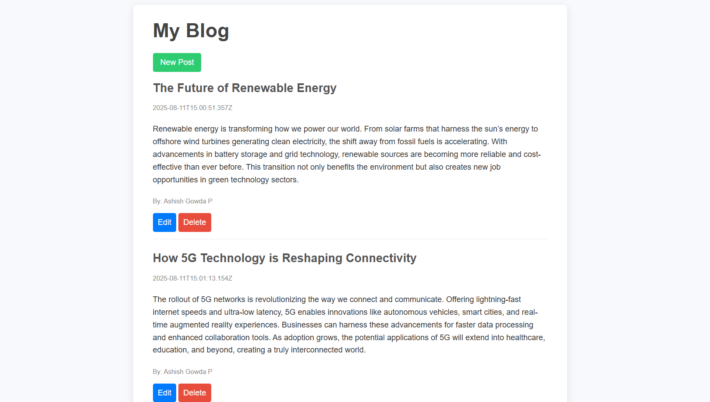

# My Blog Project 📰

A simple blog application where users can create, read, update, and delete blog posts.  
Built with a clean UI and basic CRUD functionality.

## Features
- 📝 Create new blog posts  
- 📖 View existing blog posts  
- ✏️ Edit blog posts  
- 🗑️ Delete blog posts  
- 👤 Author name display with timestamps  

## Technologies Used
- HTML / CSS / Bootstrap  
- JavaScript (Frontend logic)  
- Node.js & Express.js (Backend)  
- MongoDB (Database)  

## Installation

1. Clone the repository:
   ```bash
   git clone https://github.com/phantomxcode/BlogProject.git
   ```
2. Navigate into the project folder:
   ```bash
   cd BlogProject
   ```
3. Install dependencies:
   ```bash
   npm install
   ```
4. Start the development server:
   ```bash
   npm start
   ```
5. Open in your browser:
   ```
   http://localhost:3000
   ```

## Preview

